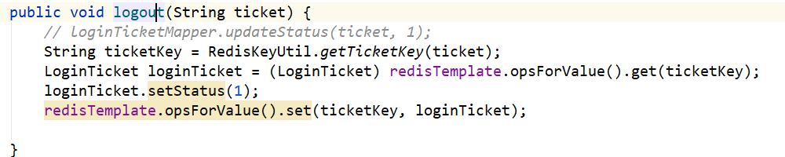
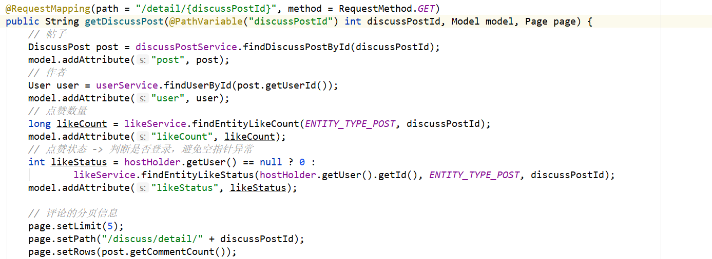
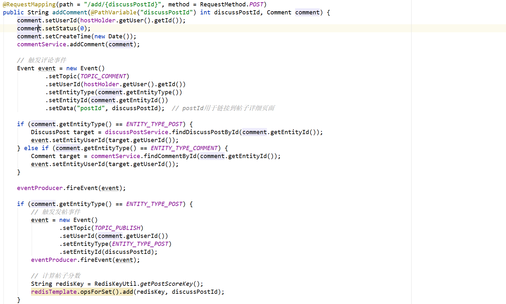
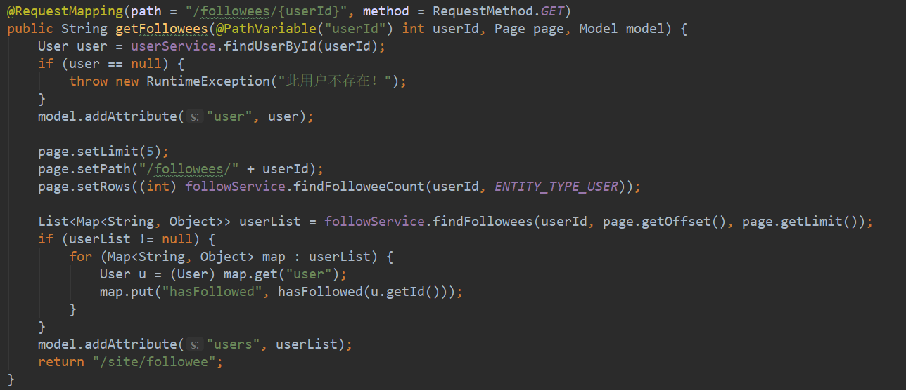
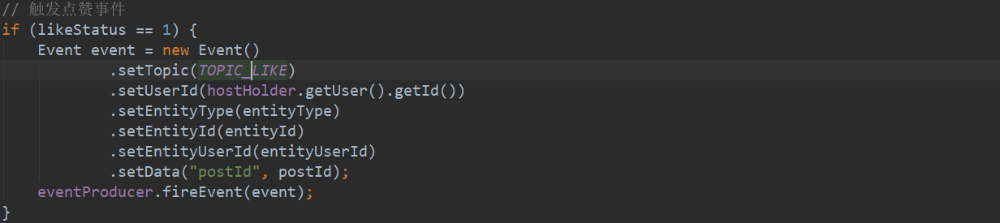
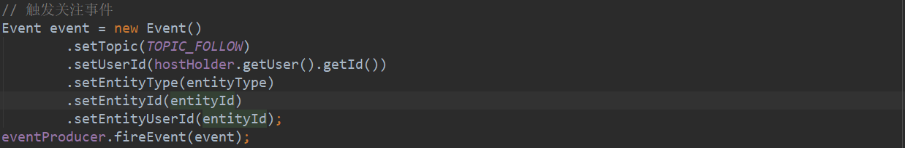

# 牛客社区项目笔记

## 基础知识

### Spring MVC处理流程

1、浏览器发送请求，直接请求到DispatcherServlet

2、DispatcherServlet调用HandlerMapping，找到对应的控制器方法，将控制器方法封装成HandlerMethod对象，和匹配到的拦截器一起返回给DispacherServlet，HandlerMethod和拦截器合在一起叫做HandlerExecutionChain（执行链）对象

（例如根据 /index 路径找到 @RequestMapping("/index") 对应的控制器方法）

3、DispatcherServlet接下来会：

- 调用拦截器的preHandle
- HandlerAdapter 调用 handle 方法，**处理方法参数与参数返回值（待补充）**，返回ModelAndView对象
- 调用拦截器的postHandle

4、处理异常或视图渲染

- 如果1~3出现异常，走 ExceptionResolver 处理异常
- 正常，走 ViewResolver 视图解析和渲染

、5、调用拦截器的 afterCompletion 方法


### Cookie和Session

为了跟踪用户的整个会话过程，解决HTTP**无状态**的缺点（一旦数据交换完毕，客户端与服务器端的连接就会关闭，再次交换数据需要建立新的连接。这就意味着服务器无法从连接上跟踪会话），常用的会话跟踪技术有Cookie和Session

#### Cookie

- 数据放在浏览器上，相当于服务端给的通行证
- Java中把Cookie封装成了 javax.servlet.http.Cookie 类，是键值对的形式
  - 通过 request.getCookie()获取客户端提交的所有Cookie 
  - 通过 response.addCookie(Cookiecookie)向客户端设置Cookie 

#### Session

- 数据放在服务器上，相当于客户端有一张客户明细表
- 将session_id作为 Cookie 发送给客户端，作为区分
- Session对应的类为javax.servlet.http.HttpSession类，也是键值对的形式
  - 通过 session.setAttribute() 设置用户状态信息
  - 通过 session.getAttribute() 读取用户状态信息


### ThreadLocal

#### 特点

从字面上理解ThreadLocal就是 “线程局部变量” 的意思，一个ThreadLocal在一个线程中是共享的，在不同线程之间又是隔离的（每个线程都只能看到自己线程的值） 

简单来说，**ThreadLocal的核心作用：实现线程范围的局部变量** 

实现原理：存入的ThreadLocal中的数据实际上并没有存到ThreadLocal对象中去，而是以这个ThreadLocal实例作为key（实际上key是ThreadLocal的一个弱应用）存到了当前线程中的一个Map（ThreadLocalMap）中去了 

ThreadLocal 的 get() 和 set() 方法，底层的执行流程类似于 HashMap 的流程，不过没有链表和红黑树结构

#### 内存泄露问题

ThreadLocal内存泄露还要从ThreadLocalMap中的Entry说起 

```java
static class ThreadLocalMap {
	/**
	 * 键值对实体的存储结构
	 */
	static class Entry extends WeakReference<ThreadLocal<?>> {
		// 当前线程关联的 value，这个 value 并没有用弱引用追踪
		Object value;
		/**
		 * 构造键值对
		 * @param k k 作 key,作为 key 的 ThreadLocal 会被包装为一个弱引用
		 * @param v v 作 value
		 */
		Entry(ThreadLocal<?> k, Object v) {
			super(k);
			value = v;
		}
	}
}
```

Entry继承至 `WeakReference`，这说明Entry中的key，也就是ThreadLocal的引用，是弱引用所持有的，这样如果ThreadLocal没有被其他线程的强引用所引用，一旦垃圾回收器运行后扫描到弱引用，便会回收，导致Entry的key为null。

但是此时如果线程没有退出，仍然持有着ThreadLocalMap，而ThreadLocalMap又会持有Entry的引用，value却不会被回收掉。只有当Thread退出后整个Entry被回收，或者set和get操作时，将这个无用的value引用断开。

#### 使用场景

ThreadLocal 的特性也导致了应用场景比较广泛，主要的应用场景如下：

- 线程间数据隔离，各线程的 ThreadLocal 互不影响
- 方便同一个线程使用某一对象，避免不必要的参数传递
- 全链路追踪中的 traceId 或者流程引擎中上下文的传递一般采用 ThreadLocal
- Spring 事务管理器采用了 ThreadLocal
- Spring MVC 的 RequestContextHolder 的实现使用了 ThreadLocal

### Spring Security的代码流程

### Spring 线程池

项目中使用 **ThreadPoolTaskScheduler** 来检测文件是否存在

### Quartz的基本使用和概念

### Kafka常见面试题

```java
// todo
```


## 权限相关

### 注册

页面：POST请求，设置表单的动作


输入框中输入的的User信息，作为参数传到register方法中，同时，业务层返回一个map，用于返回错误信息，key用来标识哪里出错，value为出错的原因，如果为空，表示没有出错


#### MD5加密

注册用户	：salt是一个5位的随机字符串


#### 发送激活邮件

邮件内容为激活链接，邮件的发送是通过创建JavaMailSender对象实现的


用户访问激活邮件中的url，后台比对激活码，将用户的状态改为1，注册成功。

### 登录

页面：显示验证码，通过 js 提供刷新验证码功能


服务端如何知道验证码是对应哪个用户的？这种联系关系就要用到Session（后续优化时改为了通过Cookie和redis来实现）


过了验证码这关，用户登录成功的登录状态要怎么保持呢？通过登录凭证（一个随机字符串）和拦截器（Interceptor）来实现，将这个凭证先通过Cookie传到浏览器


浏览器再次发送请求时，拦截器拦截到请求，如果凭证有效，用ThreadLocal保存用户信息，添加到要返回的ModelAndView对象中


这样页面上就可以通过ThreadLocal对象来判断用户是否登录了


### 退出

客户端发起退出请求时带上登录凭证，后台将登陆凭证设为失效（后续优化时，登录凭证改用redis存储）




### 授权

之前用 ThreadLocal 保存用户信息的时候，正好可以给用户授权，用户认证的结果，需要存入 SecurityContext，代码参见前面拦截登录凭证的代码


用户权限：没登录不能直接进入设置界面，在需要登录才能进入的方法上增加自定义注解 @LoginRequired（自定义拦截器实现），重定向到登录界面


（后续优化时，和权限相关的部分都改为使用 Spring Security 实现）

SecurityConfig 配置类中，重写其父类 WebSecurityConfigurerAdapter 的 configure 方法，根据授权增加访问权限


权限不够时的处理


### 设置

#### 更换头像（客户端上传）


前端：单击表单提交时，由 Ajax 异步将数据按照设置信息传给云服务器，上传成功会更新图像路径


更新数据库中的头像路径


#### 分享长图（服务端直传）


消费分享事件，因为wk制作长图需要一定时间，需要等其制作完毕才能上传，**启用一个定时任务线程专为检测长图文件是否存在（每500ms检测一次）**，可以用Spring定时线程池，只有当前消费者线程在使用，只有一个服务器在处理，处理完后就结束，不涉及到集群问题。

UploadTask 是在 EventConsumer 中定义的内部类，Future：线程池创建线程的结果，可以使用这个接口提供的方法结束当前线程


强制结束线程的两种情况


上传图片的处理逻辑


## 核心功能

### 数据库表设计

```sql
1. user 表：
id, username, password, salt, email, type, status, activation_code, header_url, create_time.

2. discuss_post 表：
id, user_id, title, content, type, status, create_time, comment_count, score.

3. comment 表：
id, user_id, entity_type, entity_id, target_id, content, status, create_time.

4. message 表：
id, from_id, to_id, conversation_id, content, status, create_time.

5. login_ticket 表：
id, user_id, ticket, status, expired.
```

### 首页

#### 分页处理

定义一个Page类用来封装分页信息


Page类中几个重要的方法：（在controller中，必须要设置的是Rows和path）

```java
public int getOffset() { return current * limit - limit; } // 计算起始行
public int getTotal() {...} // 计算总页数
public int getFrom() {...}  // 起始页码，current-2
public int getTo() {...}    // 结束页码，current+2
```

页面上的分页处理，主要是通过传入不同的 current 值


分页查找帖子，按照时间或者热度，userId传0，则不限制userId，对应的SQL语句如下


查到的一页帖子，每一条帖子都封装成一个map，map中除了包含这条帖子post，还有发帖的用户user以及帖子的获赞数likeCount，然后再将这些封装好的map放入一个叫做discussPosts的List，这样就把每条帖子和对应帖子的相关信息独立封装好了，方便页面调用。


帖子列表


### 帖子相关

#### 发帖

向discuss_post表中新增一条记录；触发发帖事件，同步es中的数据；新帖子的id先记录进redis，后续统一更新分数


#### 更新帖子分数

使用Quartz，每隔5分钟，取得新帖子的id，统一更新分数


帖子分数和以下参数相关，其中取log的作用是降低分数的方差


#### 查看帖子详情

url中携带对应帖子的 id，通过帖子id找到响应的帖子信息，并处理分页信息



显示帖子的评论和楼中楼，和首页的处理类似，查到的一页评论和回复，每一条都封装成一个map（commentVo和replyVo），其中 findCommentByEntity() 方法既用来找评论，也用来找回复


#### 过滤敏感词


### 评论相关

#### 添加评论

给帖子的评论以及给评论的回复都在 comment 表中，通过字段 entity_type 来区分，同时，字段 target 表示回复的用户id，直接回复给帖子或者评论的内容 target 字段为0（以下触发评论事件用来发送全站通知之后再细讲，触发发帖事件是用来更新帖子分数的，这个前面已经提到过）



事务处理，使用将注解加在方法上的声明式事务方式，读提交的隔离级别可以避免脏读问题


通过页面上的隐藏输入框给 comment 的 entityType，entityId 和 target 赋值。


### 私信相关

#### 查看私信列表

为了方便用户查看，和同一个用户的所有私信内容只用显示最新的一条，用户可以点击这条最新的私信内容进入会话详情页面，在表现层中，还是将每条会话中最新的私信，私信数，未读私信数，私信目标用户封装成一个map


那么如何查找当前用户所有会话中，最新的一条私信以及当前用户的会话数量呢


#### 查看私信详情

根据会话id查找这条会话中包含的私信内容，同样用map封装一下，同时获取这一页私信内容的id，统一将对应的私信条目 status 字段更新为1，设置为已读


#### 发私信

没啥好说的，注意conversationId中，userId小的在前面


### 点赞相关

点赞设置成一个按钮，点击后调用 js 中的 like() 函数


js 中的 like() 函数调用 likeController 中的like函数，返回likeStatus和likeCount的值，实现不刷新页面查看点赞用户的点赞状态


likeService 中的like函数是用 redis 存储点赞信息的关键，entityType，entityId等参数从页面上可以取到


```java
// 点赞相关的RedisKey设置
String entityLikeKey; // 某个实体的赞 like:entity:entityType:entityId -> set(userId)
String userLikeKey;   // 某个用户的获赞数 like:user:userId -> string(个数)
```


### 关注相关

#### 关注与取关

关注设置成一个按钮


js 代码中根据按钮的样式选择调用 follow 函数还是 unfollow 函数，entityId 通过隐藏输入框传到函数中去


调用该函数的是 js 发出的异步请求，返回 JSON 格式的字符串，所以加上 @Response 注解


```java
// 关注相关的RedisKey设置
String followeeKey; // 某个用户关注的实体 followee:userId:entityType -> zset(entityId, now)
String followerKey: // 某个用户的粉丝 follower:entityType:entityId -> zset(userId, now)
// 当前只支持 entityType 为3，即对用户的关注，entityId为用户id
```

注意，关注动作执行时，是将当前查看的那个用户的id加入followee（即我关注了XX），同时将当前登录的用户id加入follower（即我成了XX的粉丝）


unfollow 同理


#### 查看关注和粉丝列表

查看XX用户关注的人，路径中拼上当前查看的用户id，表现层中遍历XX用户关注的用户，判断当前登录用户有没有关注（hasFollowed方法中通过 redisTemplate.opsForZSet.score(redisKey, entityId) 是否为空来判断）



根据当前用户id拼出要查找的redisKey，分页查找zset，因为找到的只是用户的id，还要去根据id找到对应的用户，同时每一条用户对象和对应的关注时间封装成一个map，加入list一起返回给表现层


查看XX用户的粉丝同理


## 全站通知

### 发送通知

评论、点赞、关注操作后，触发对应的事件







消费者端，message 的 from_id 设置为系统，message 的 to_id 设置为接收系统消息的userId，会话Id设置为主题名称（如 coment, like, follow）,content 设置为JSON格式的键值对格式


### 查看通知页面

从数据库中找到最新的一条评论类型的通知，将数据库中 JSON 格式的字符串content转换成data对象，封装成一个map类型的messageVo提供给页面，帮助页面显示，其他类型的通知（点赞、关注）处理相同。


### 查看通知详情

查找对应主题类型的所有通知，同样将每一条通知封装成一个map（noticeVo），entityId和postId用来帮助拼接超链接，能够跳转到帖子详情页面


## 异常处理与日志记录

### 统一异常处理

数据层和业务层的异常都抛到表现层统一处理，如果是异步请求，返回JSON格式的信息，同步请求则转到错误页面，通过控制器通知 ControllerAdvice 来实现


### 统一日志记录

想对业务层统一记录日志，而统一记录日志是系统功能，不要和业务功能混在一起实现。否则在想对记录日志的位置进行改变时，将会非常麻烦，因为业务bean有很多个，不好一个一个改。 

由此引入了AOP的方式，即面向切面编程，切面是一个一个组件。业务Bean是一个一个target。我们要先声明切点的位置，再通知要做什么事。只需要对切面组件编程即可，不需要再进到业务Bean中去改，提升了编程效率。 


